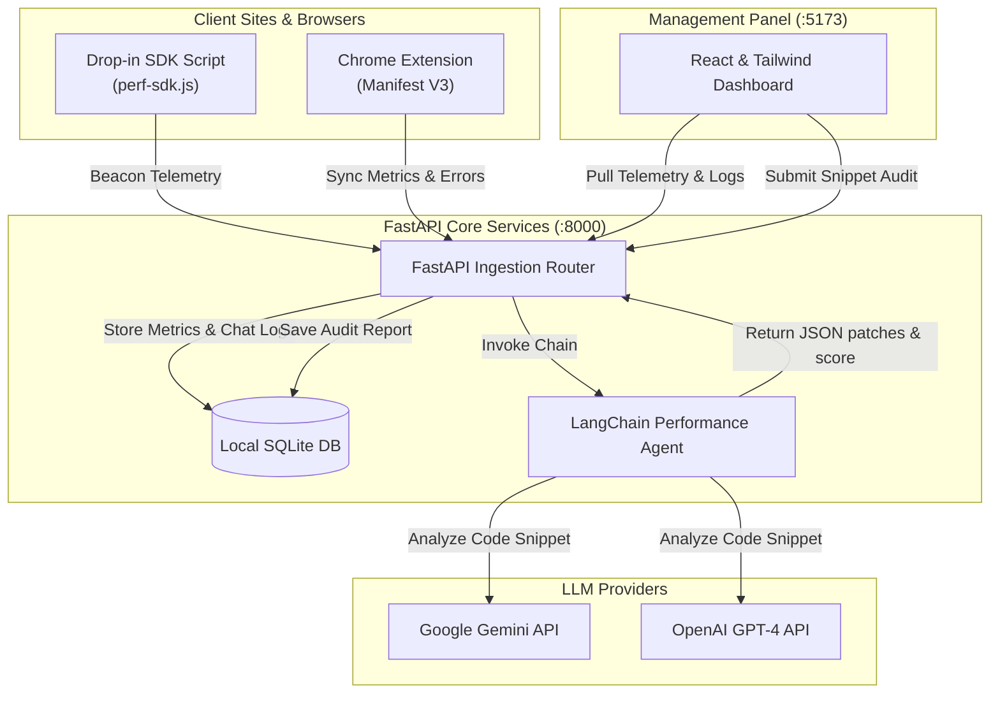

<<<<<<< HEAD
=======
# Team SuperSonnet

>>>>>>> d986d7cd1b477f343bc1040e1f72486f72c70724
# ComplianceAgent AI - Frontend Performance & Core Web Vitals Auditor

ComplianceAgent AI is an autonomous frontend compliance and performance monitoring agent. It tracks live Core Web Vitals (LCP, CLS, FID/INP) and JavaScript errors in real-time, analyzes codebases using a LangChain AI agent to locate regressions, and generates side-by-side git diff optimization patches automatically.

## Why This Wins (Business Impact)
- **Proactive Regression Prevention**: Instead of waiting for users to submit bug tickets about laggy pages, ComplianceAgent AI catches issues during development and CI/CD pipelines.
- **Developer Overhead Reducer**: Explaining *why* a layout shift occurs or refactoring complex async React hooks can take hours. The AI agent generates the exact drop-in code fix, reducing debugging cycles by up to 80%.
- **SEO & Conversions Guard**: Core Web Vitals directly impact Google Search rankings and bounce rates. Maintaining a green status ensures optimal SEO health and maximizes user retention.
- **Universal Pluggability**: Integrates instantly into any codebase using a single `<script>` tag or via a Chrome Extension for zero-code testing on any site.

---

## Technical Architecture

The data pipeline runs asynchronously to prevent impacting user experience:



---

## Features
1. **Traffic Light Risk Dashboard**: Color-coded risk status (Green, Amber, Red) based on Lighthouse targets.
2. **Real-time Charting**: Interactive Recharts plots detailing average load times, paint delays, and visual layout shift trends.
3. **JS Exception Monitor**: Captures uncaught scripts exceptions, displays file traces, and provides instant resolution advice.
4. **AI Code Auditor**: Side-by-side Git diff viewer highlighting performance regressions and the optimized code fixes.
5. **Interactive Copilot Chat**: An interactive workspace to debug component layout structures and ask for general optimization tips.
6. **Active Traffic Stream Simulator**: Built-in test generator that pushes synthetic performance telemetry to verify dashboard alerts.

---

## Getting Started

### Prerequisites
- Node.js (v18+)
- Python (v3.10+)

### 1. Backend Installation & Start
1. Navigate to the backend directory:
   ```bash
   cd backend
   ```
2. Create and activate a Python virtual environment:
   ```bash
   python -m venv venv
   # On Windows:
   .\venv\Scripts\activate
   # On Unix/macOS:
   source venv/bin/activate
   ```
3. Install required packages:
   ```bash
   pip install -r requirements.txt
   ```
4. Create a `.env` file in the backend root directory (optional, fallback offline analysis will execute automatically if omitted):
   ```env
   GEMINI_API_KEY=your_gemini_key_here
   OPENAI_API_KEY=your_openai_key_here
   ```
5. Run the server:
   ```bash
   python run.py
   ```
   The API documentation will be available at `http://localhost:8000/docs`.

### 2. Frontend Installation & Start
1. Navigate to the frontend directory:
   ```bash
   cd frontend
   ```
2. Install dependencies:
   ```bash
   npm install
   ```
3. Run the development server:
   ```bash
   npm run dev
   ```
   Access the dashboard at `http://localhost:5173`.

### 3. Loading the Chrome Extension
1. Open Google Chrome and navigate to `chrome://extensions/`.
2. Enable **Developer Mode** using the toggle switch in the top-right.
3. Click **"Load unpacked"** in the top-left.
4. Select the `extension` folder located inside the project repository.
5. The extension is now active! Open the popup on any webpage to see rendering performance and sync metrics.

### 4. Drop-in HTML SDK integration
Include this script tag inside the `<head>` of any HTML template to monitor it automatically:
```html
<script src="http://localhost:8000/sdk/perf-sdk.js" defer></script>
```
